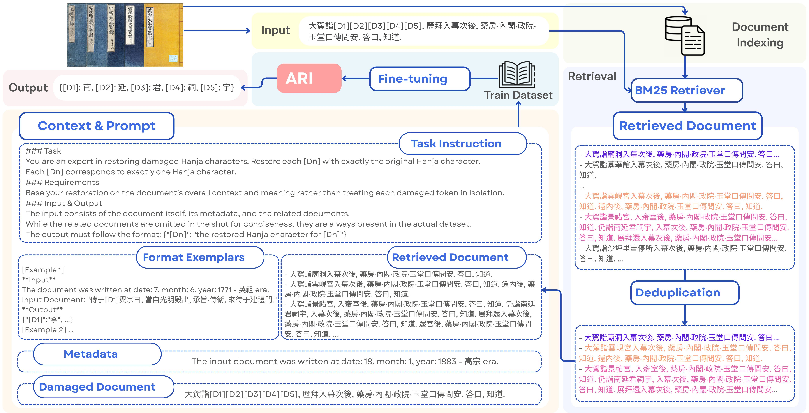
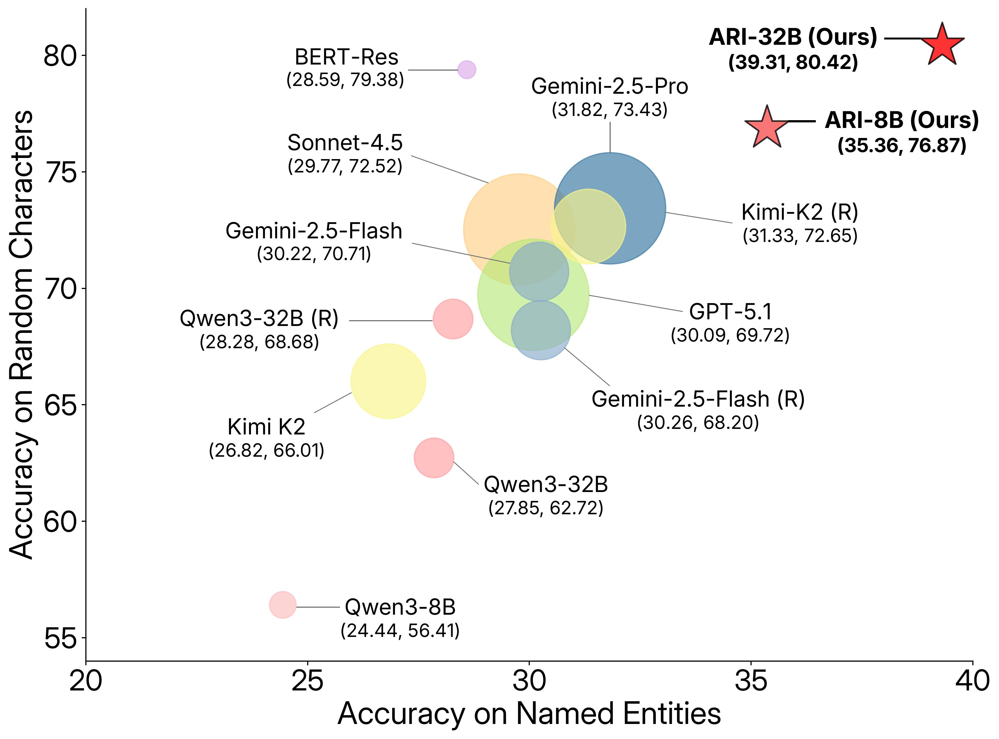

<h1 align="center"> Leveraging External Knowledge for Historical Document Restoration via Retrieval-Augmented Large Language Models </h1>

<p align="center"> 📄 <a href="https://aclanthology.org/2026.findings-acl.2148/">Paper</a> &nbsp;|&nbsp; 🤗 <a href="https://huggingface.co/collections/DAMI-Lab/ari-archive-restoration-intelligence">Model</a> </p>



## News
- **💭 [2026.07.05] Our paper was presented at the ACL 2026 poster session.**
- **✨ [2026.05.14] ARI-32B and ARI-8B models were officially released.**
- **🎉 [2026.04.06] ARI was accepted to Findings of ACL 2026.**

## Overview
**ARI (Archive Restoration Intelligence)** is a specialized framework engineered to restore damaged or illegible Hanja characters within the historical records of the Joseon Dynasty, such as the Annals of the Joseon Dynasty (AJD) and the Journal of the Royal Secretariat (JRS). By integrating Retrieval-Augmented Generation (RAG), ARI effectively overcomes the fundamental limitations of conventional masked language models and off-the-shelf LLMs. Specifically, it excels in recovering Named Entities—including personal names (PER), locations (LOC) etc.—that necessitate precise external historical context rather than mere local linguistic patterns. ARI bridges the gap between internal document context and external knowledge archives, providing a practical and robust tool for historical document restoration.

## Key Innovation
- RAG-Driven Restoration Framework: Combines the implicit knowledge of LLMs with explicitly retrieved external knowledge to mitigate the challenge of inferring proper nouns.
- NE-Prioritized Training: Uses a 25% named entity-prioritized masking strategy during training to maximize performance on knowledge-intensive segments.

## Method
- Retrieval Strategy: We employ a BM25 retriever to extract the top 20 relevant documents from historical corpora, which serve as few-shot context. To ensure the diversity of external knowledge, a string similarity threshold of 0.8 is applied to filter out redundant information.
- Fine-tuning: ARI-32B was developed by fine-tuning the Qwen3 32B base model on a specialized dataset exceeding 16 billion tokens of ancient Korean-Hanja records. As a computationally efficient alternative, we also provide ARI-8B, a variant based on the Qwen3 8B architecture.
- Knowledge Integration: By synthesizing implicit knowledge stored within the model parameters with explicit knowledge from retrieved document, the system effectively bridges the gap between general linguistic patterns and specific historical facts. This integration allows the model to rectify potential hallucinations and produce contextually grounded restorations that are both linguistically fluent and historically accurate.

## Results
ARI-32B outperforms baseline models and general-purpose proprietary LLMs in both random character and named entity restoration.



## Analysis
- Lexical vs. Semantic: Lexical character matching (BM25) outperformed embedding-based retrieval, likely due to the logographic nature of Hanja.
- Temporal Domain Shift: Performace declines as the temporal gap increases, highlighting ARI's reliance on period-specific background knowledge.
- Human-Expert Validation: In blind tests, experts selected ARI-32B's restoration candidates as the most factually valid and contextually coherent.

## Citation
```bibtex
@inproceedings{kim-kang-2026-leveraging,
  title     = {Leveraging External Knowledge for Historical Document Restoration via Retrieval-Augmented Large Language Models},
  author    = {Kim, Gabeen and Kang, Kyeongpil},
  booktitle = {Findings of ACL 2026},
  year      = {2026},
  pages     = {43290--43304},
  doi       = {10.18653/v1/2026.findings-acl.2148}
}
```

## Contributor
- Gabeen Kim (Department of AI Convergence, Kangwon National University)
- Kyeongpil Kang (Department of Computer Science and Engineering, Kangwon National University)

> **Dataset Access:** The train, valid, and test datasets are available upon request. 
> Please reach out to gabeega020@gmail.com for inquiries.